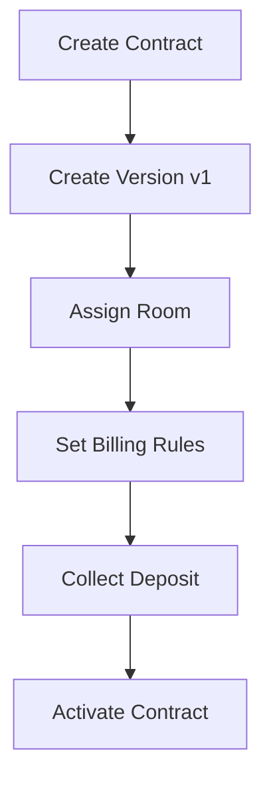
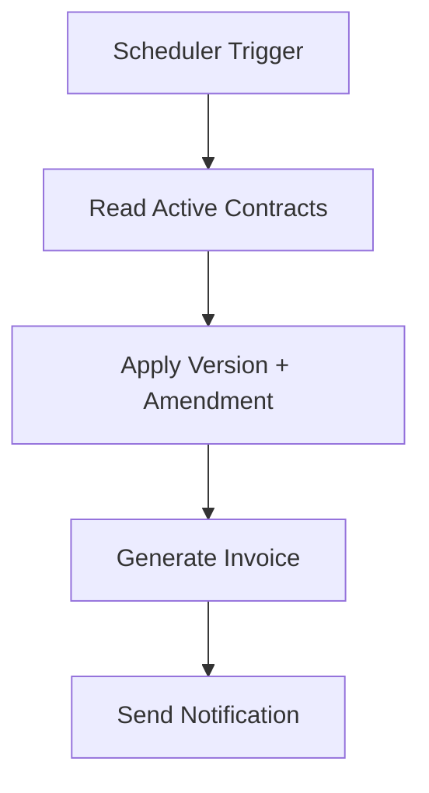
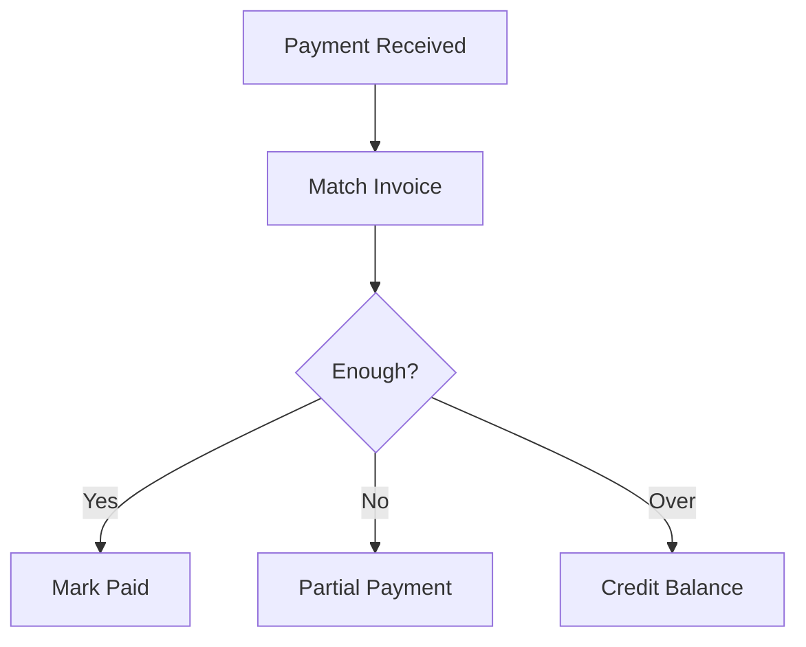
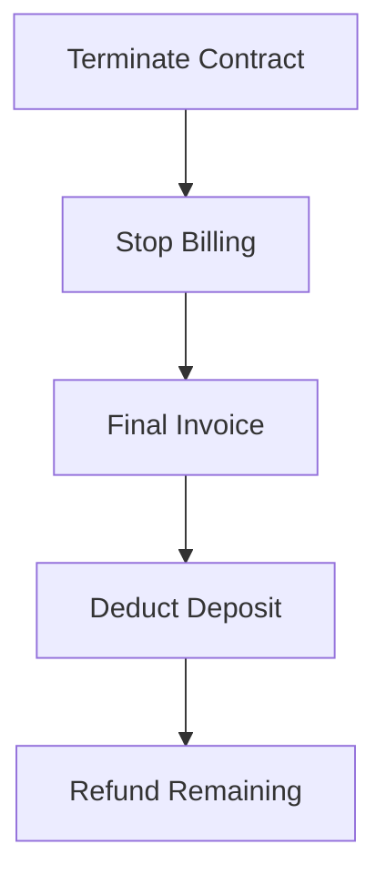

# 🏢 Contract System Design (SaaS-ready) – Boarding House Management

## 🎯 Mục tiêu
Thiết kế hệ thống hợp đồng:
- Linh hoạt (support nhiều rule thực tế)
- Không mất lịch sử (audit full)
- Scale được (multi-tenant SaaS)
- Tích hợp chặt với billing + payment + room

---

# 🧠 1. Core Principles

## ❗ Hợp đồng KHÔNG phải 1 record
Hợp đồng = 
> Timeline + State + Version + Rule + Financial Flow

---

## 🧩 Các thành phần chính
- Contract (gốc)
- Contract Version
- Amendment (phụ lục)
- Billing Rule
- Deposit Ledger
- Contract State Machine

---

# 🗂️ 2. Database Design

## 2.1 Contract (root entity)
```sql
contracts
- id
- contract_code
- tenant_id
- room_id
- start_date
- end_date
- status (DRAFT, ACTIVE, TERMINATED, ...)
- auto_renew (boolean)
- created_at
- updated_at
````

---

## 2.2 Contract Versions (versioning)

```sql
contract_versions
- id
- contract_id
- version_number
- price
- deposit_amount
- billing_cycle (MONTHLY, DAILY,...)
- effective_from
- effective_to
- created_by
- created_at
```

👉 Không overwrite → luôn tạo version mới

---

## 2.3 Amendments (phụ lục)

```sql
contract_amendments
- id
- contract_id
- type (PRICE_CHANGE, ADD_OCCUPANT,...)
- effective_from
- data (JSON)
- note
- created_at
```

👉 Billing sẽ đọc:

> base contract + amendments

---

## 2.4 Billing Rules

```sql
contract_billing_rules
- id
- contract_id
- utility_id
- cycle (MONTHLY, WEEKLY, DAILY)
- unit_price
- calculation_type (FIXED, METERED)
```

---

## 2.5 Deposit Ledger

```sql
deposit_transactions
- id
- contract_id
- type (COLLECT, DEDUCT, REFUND)
- amount
- reference (invoice_id, maintenance_id)
- note
- created_at
```

👉 Không lưu deposit dạng 1 field → dùng ledger

---

## 2.6 Contract State Machine

```sql
contract_states
- DRAFT
- PENDING
- ACTIVE
- EXPIRING
- TERMINATED
- VIOLATED
```

---

# 🔄 3. Business Flows

---

## 3.1 Create Contract



---

## 3.2 Billing Flow



---

## 3.3 Payment Flow



---

## 3.4 End Contract



---

# 💡 4. Advanced Features

---

## 🔁 4.1 Pro-rate Engine

```text
rent = monthly_price / days_in_month * actual_days_used
```

Support:

* join mid-month
* leave early
* different month lengths

---

## 🔄 4.2 Auto Renewal

```text
IF contract.expired AND auto_renew = true
→ create new version OR extend contract
```

Optional:

* increase price (%)
* change terms

---

## 🚨 4.3 Penalty Engine

```text
IF overdue_days > 3 → +50k/day
IF overdue_days > 10 → apply penalty %
```

---

## 🔁 4.4 Room Transfer

Flow:

* terminate old contract (partial)
* create new contract
* split billing
* move deposit

---

## 📊 4.5 Reconciliation Engine

Track:

* invoice_total
* paid_amount
* outstanding

Support:

* partial payment
* overpayment
* multi-payment

---

# 🧱 5. System Architecture

## Modules

* Contract Service
* Billing Service
* Payment Service
* Notification Service
* Asset Service

---

## Data Flow

```text
Contract → Billing → Invoice → Payment → Reconciliation
```

---

# 🔐 6. Multi-tenant Design (SaaS)

Add vào mọi bảng:

```sql
tenant_id
```

👉 đảm bảo:

* isolation data
* scale nhiều chủ trọ

---

# ⚠️ 7. Pitfalls (tránh sai lầm)

❌ Update contract trực tiếp
✔️ Luôn version

❌ Lưu deposit 1 field
✔️ Dùng ledger

❌ Hardcode billing
✔️ Dùng rule

❌ Không track lịch sử
✔️ Audit full

---

# 🚀 8. MVP vs Advanced

## MVP (nên làm trước)

* Contract
* Version
* Billing monthly
* Deposit basic
* Invoice

## Advanced

* Amendment
* Rule engine
* Auto renewal
* Penalty
* Transfer room

---

# 🏆 9. Kết luận

Một hệ thống hợp đồng chuẩn SaaS cần:

* Immutable (không overwrite)
* Timeline-based
* Rule-driven
* Financially consistent

👉 Nếu làm đúng:

> Bạn không chỉ build app quản lý trọ
> mà đang build **core financial system**

---

```
```
